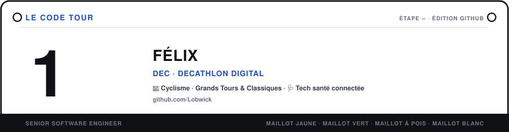
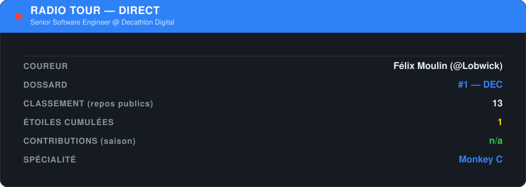
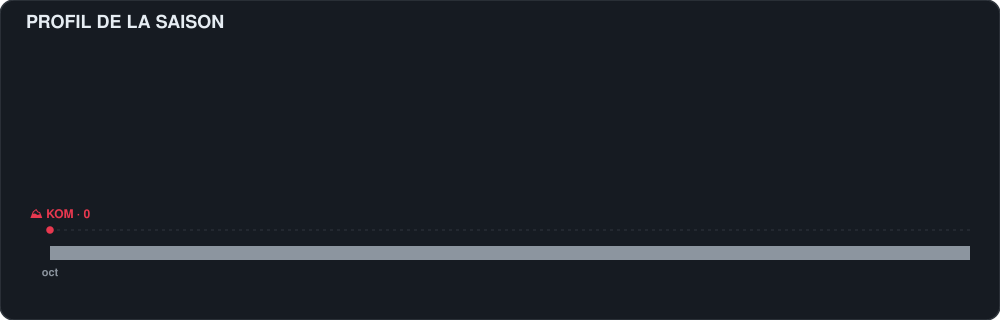
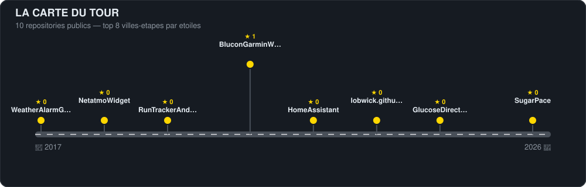
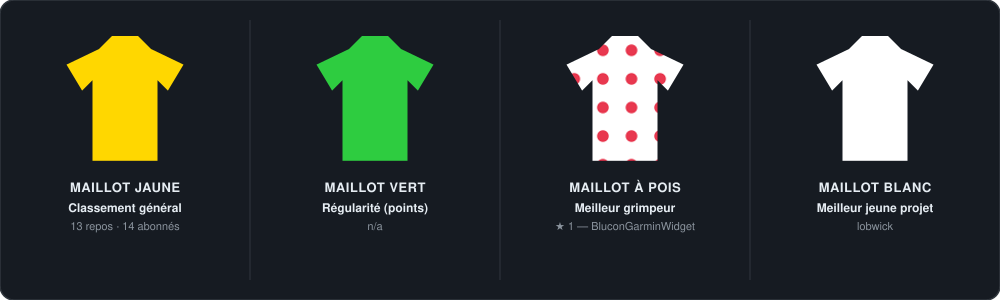

  

### 🚴 Le coureur

Je suis **Senior Software Engineer** chez **Decathlon Digital**. Passionné de **cyclisme** — Tour de France, Giro, Vuelta, classiques du printemps — je regarde le sport un peu comme j'écris du code : à base de gestion d'effort, de lecture de course et de longues sorties pour progresser.

En parallèle, je m'intéresse aux **objets connectés** et à ce qu'ils peuvent apporter concrètement à la gestion du **diabète** et du **sport** — capteurs, données en temps réel, boucle fermée.

---

### 📻 Radio Tour — en direct

  <picture>
    <source media="(prefers-color-scheme: dark)" srcset="./assets/radio/radio-dark.svg" />
    <source media="(prefers-color-scheme: light)" srcset="./assets/radio/radio-light.svg" />
    
  </picture>

---

### ⛰️ Profil de la saison

*Mes contributions GitHub de l'année, dessinées comme un profil d'étape — chaque jour actif est une portion d'ascension, colorée par catégorie d'effort (du plat ⚪ au hors-catégorie 🟡).*

  <picture>
    <source media="(prefers-color-scheme: dark)" srcset="./assets/stage/stage-dark.svg" />
    <source media="(prefers-color-scheme: light)" srcset="./assets/stage/stage-light.svg" />
    
  </picture>

---

### 🗺️ La carte du Tour

*Mes dépôts publics, placés le long de la route comme des villes-étapes : la position suit la date de création, la hauteur du fanion suit le nombre d'étoiles.*

  <picture>
    <source media="(prefers-color-scheme: dark)" srcset="./assets/route/route-dark.svg" />
    <source media="(prefers-color-scheme: light)" srcset="./assets/route/route-light.svg" />
    
  </picture>

---

### 🏆 Maillots distinctifs

  <picture>
    <source media="(prefers-color-scheme: dark)" srcset="./assets/jerseys/jerseys-dark.svg" />
    <source media="(prefers-color-scheme: light)" srcset="./assets/jerseys/jerseys-light.svg" />
    
  </picture>

---

### 🚐 La caravane technique

| **Rouleurs**  cœur du métier | **Grimpeurs**  cloud & infra | **Sprinteurs**  IoT & santé connectée |
| :--- | :--- | :--- |
|   |   |  |
|   |   |  |
|  |  |  |

Badges indicatifs — à ajuster librement selon la stack réellement utilisée au quotidien.

---

### 🌿 Carnet de route

Dernière activité GitHub publique, format carnet de course. Mis à jour automatiquement par le workflow ci-dessous.

<!-- FEED:START -->
<pre>
📻 <b>2026-10-07</b> Push sur <a href="https://github.com/Lobwick/ai-bike-coach/commit/3c81f529a90d743f31e3eaf4c220289db99540c0">Lobwick/ai-bike-coach</a>
📻 <b>2026-10-08</b> Push sur <a href="https://github.com/Lobwick/ai-bike-coach/commit/d7057027202344efd16fedaf06de4600d6738e97">Lobwick/ai-bike-coach</a>
📻 <b>2026-10-07</b> Push sur <a href="https://github.com/Lobwick/ai-bike-coach/commit/769e9e68edfdf1ab1ee31139c9b85869994eaa3f">Lobwick/ai-bike-coach</a>
📻 <b>2026-10-07</b> Push sur <a href="https://github.com/Lobwick/ai-bike-coach/commit/b1382e9ee0e7bd59f73bd887e253d079cb2e41ce">Lobwick/ai-bike-coach</a>
📻 <b>2026-10-07</b> Push sur <a href="https://github.com/Lobwick/ai-bike-coach/commit/8cdbcd2b6ed2db31419a06c1b212cade00104f75">Lobwick/ai-bike-coach</a>
📻 <b>2026-10-07</b> Push sur <a href="https://github.com/Lobwick/ai-bike-coach/commit/95ceb6ab9ec7d39f09e61e736aee58a90bd0f7d9">Lobwick/ai-bike-coach</a>
📻 <b>2026-10-07</b> Push sur <a href="https://github.com/Lobwick/ai-bike-coach/commit/cbac85682f39eb9cbbce3fdab176b1f9c2f1a797">Lobwick/ai-bike-coach</a>
📻 <b>2026-10-07</b> Push sur <a href="https://github.com/Lobwick/open-wearables/commit/07514d4c29b5ef0d2520e5739f56b961d24c8cb5">Lobwick/open-wearables</a>
</pre>
<!-- FEED:END -->

---

### 📫 Partenaires de route

  
  
  
  

  <i>« On ne gagne pas le Tour de France un jour, on peut le perdre un jour. » — à chaque commit son étape.</i>

